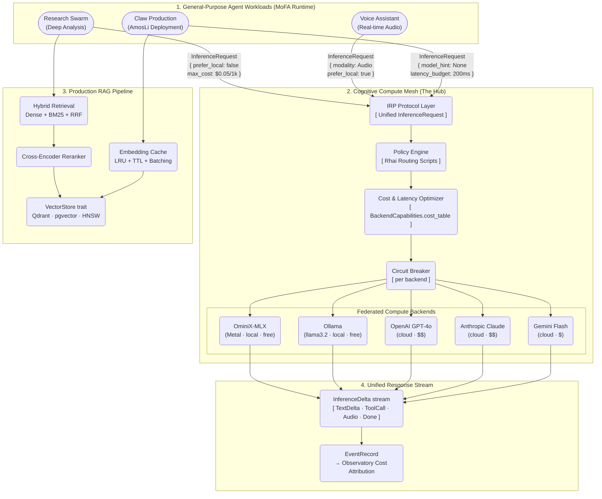
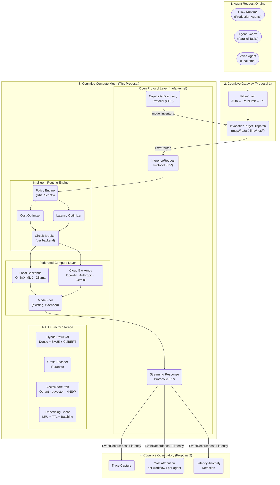
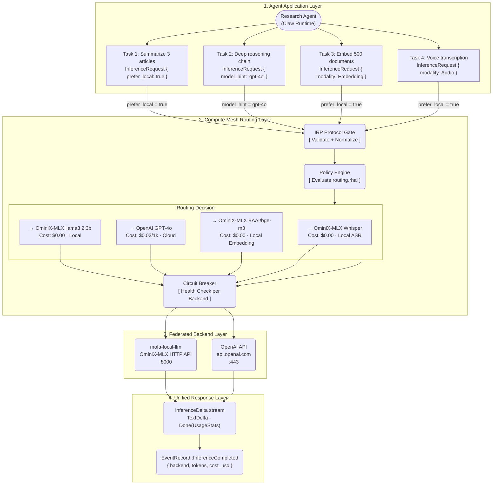

# Cognitive Compute Mesh

### Unified Inference Federation for AI Agents — MoFA GSoC 2026

## Personal Information

Name: Ashutosh Mishra Email: <ashum9dev@gmail.com>

Discord: [Ashutosh Mishra](https://discord.com/users/1258117463170617458) GitHub: [ashum9](https://github.com/ashum9)

University: AIT Pune, India Timezone: UTC+5:30 (IST)

## About Me

I am a Computer Science sophomore at AIT Pune with a year of production Rust experience in async systems, trait-based architecture, and observability infrastructure. I participate in MoFA's volunteer contributor program, working directly with the maintainers on the core framework.

My contributions to MoFA relevant to this proposal: I built the **OpenAI backend proxy and Capability Registry** (PR #885) — the current inference interface. I authored the **complete RAG infrastructure** — vector store traits (PR #851), Qdrant implementation (PR #724), indexing extensions (PR #853), and full pipeline integration (PR #854), totalling over **4,000 lines**. I also built the **multi-provider voice pipeline** (PRs #1021, #1023, #1024) with kernel trait contracts, cloud adapters, and foundation registry for TTS and ASR — the kernel-to-foundation-to-adapter layering this proposal applies to inference backends. Every layer this proposal extends is a layer I originally wrote.

Before MoFA, I built Synelar — a portable digital identity system with encrypted off-chain profiles and storage backends on IPFS and Arweave, both behind a unified Rust trait. The pluggable adapter architecture from that project is structurally identical to what this proposal builds for inference backends behind `InferenceBackend`.

## Past Experience

**Languages:** Rust (primary, 1+ year), TypeScript, Java, Python, C++

**Systems:** Async Rust with tokio, trait-based architecture, lock-free concurrency, zero-copy input/output

**Infrastructure:** axum, hyper, WebSocket, Prometheus, OpenTelemetry, Qdrant, MQTT

**Coursework:** Data Structures and Algorithms, Operating Systems, Computer Networks, Database Management Systems, Object Oriented Programming System.

Voice Authentication with IoT (Hackathon-winning project) — Gained skills in low-latency MQTT messaging and embedded systems programming, focusing on efficient resource use for real-time voice processing.

### Open Source Contributions

## Totals: 52 Pull Requests, \~22,000 lines, 300+ tests, 20+ architecture diagrams. [Full list of MoFA contributions](https://github.com/mofa-org/mofa/pulls?q=author%3Aashum9+is%3Aclosed)

**MoFA Ecosystem — 52 Pull Requests** (February 23 – March 23, 2026)

| Area | Pull Requests | Contribution |
| :----------------------: | :----------------------------------------------------------------------------------------------------------------------------------------------------------------------------------------------------------------------------------------------------------------------------------------------------------------------------------------------------------------------------------------------------------------------------------------------------------------------------------------------------------------------------------------------------------------------------------------: | :---------------------------------------------------------------------------------------------------------------------: |
| **Gateway Foundations** | [#1419](https://github.com/mofa-org/mofa/pull/1419), [#1420](https://github.com/mofa-org/mofa/pull/1420), [#1421](https://github.com/mofa-org/mofa/pull/1421), [#1425](https://github.com/mofa-org/mofa/pull/1425), [#876](https://github.com/mofa-org/mofa/pull/876), [#882](https://github.com/mofa-org/mofa/pull/882), [#883](https://github.com/mofa-org/mofa/pull/883), [#884](https://github.com/mofa-org/mofa/pull/884), [#885](https://github.com/mofa-org/mofa/pull/885) | Complete production gateway stack: microkernel traits, InMemoryRouteRegistry, ApiKeyAuthProvider, and L1 DashMap Cache. |
| **Protocol Adapters** | [#1426](https://github.com/mofa-org/mofa/pull/1426), [#1431](https://github.com/mofa-org/mofa/pull/1431) | Implementation of **A2A** task lifecycle and **MCP** tool-use adapter with SSRF protection and SSE streaming. |
| **Foundation & Memory** | [#1220](https://github.com/mofa-org/mofa/pull/1220), [#1221](https://github.com/mofa-org/mofa/pull/1221), [#1284](https://github.com/mofa-org/mofa/pull/1284) | Thread-safe InMemoryStorage implementation, semantic search integration, and comprehensive test coverage. |
| **Claw & Coordination** | [#1160](https://github.com/mofa-org/mofa/pull/1160), [#997](https://github.com/mofa-org/mofa/pull/997), [#11](https://github.com/mofa-org/mofa-skills/pull/11), [#12](https://github.com/mofa-org/mofa-skills/pull/12) | Claw layer orchestration, HandoffProtocol, ConflictDetector, and internal bridge skills. |
| **Observability (OTLP)** | [#628](https://github.com/mofa-org/mofa/pull/628), [#629](https://github.com/mofa-org/mofa/pull/629), [#630](https://github.com/mofa-org/mofa/pull/630), [#631](https://github.com/mofa-org/mofa/pull/631), [#658](https://github.com/mofa-org/mofa/pull/658), [#659](https://github.com/mofa-org/mofa/pull/659), [#660](https://github.com/mofa-org/mofa/pull/660) | Full telemetry pipeline with OTLP native exporters and Prometheus cardinality guards. **336x performance gain.** |
| **Speech, RAG & AI** | [#1021](https://github.com/mofa-org/mofa/pull/1021), [#1023](https://github.com/mofa-org/mofa/pull/1023), [#1024](https://github.com/mofa-org/mofa/pull/1024), [#724](https://github.com/mofa-org/mofa/pull/724), [#851](https://github.com/mofa-org/mofa/pull/851), [#853](https://github.com/mofa-org/mofa/pull/853), [#854](https://github.com/mofa-org/mofa/pull/854) | Multi-provider voice pipeline, complete RAG integration stack, and autonomous tool-use skills. |
| **Security & Stability** | [#723](https://github.com/mofa-org/mofa/pull/723), [#314](https://github.com/mofa-org/mofa/pull/314), [#318](https://github.com/mofa-org/mofa/pull/318), [#431](https://github.com/mofa-org/mofa/pull/431), [#525](https://github.com/mofa-org/mofa/pull/525), [#356](https://github.com/mofa-org/mofa/pull/356), [#372](https://github.com/mofa-org/mofa/pull/372), [#398](https://github.com/mofa-org/mofa/pull/398), [#401](https://github.com/mofa-org/mofa/pull/401), [#415](https://github.com/mofa-org/mofa/pull/415), [#422](https://github.com/mofa-org/mofa/pull/422) | PII redaction, deadlock fixes, injection prevention, and critical CI/infrastructure maintenance. |
| **External Projects** | [OBA #30](https://github.com/OneBusAway/vehicle-positions/pull/30), [OBA #32](https://github.com/OneBusAway/vehicle-positions/pull/32), [Neural-LAM #264](https://github.com/mllam/neural-lam/pull/264) | Fixed GTFS-Realtime parsing and optimized GNN graph operations. |

## Project Proposal

### Proposal Baseline Checklist

- [x] Clear problem definition and relevance to MoFA
- [x] Concrete technical design with modules, interfaces, and data flow
- [x] Executable timeline with measurable milestones
- [x] Risk register with mitigations and fallback plans
- [x] Prior execution evidence through merged pull requests
- [x] Testing and validation plan
- [x] Realistic weekly time commitment and communication plan

### Abstract

MoFA agents today can natively call exactly one inference backend: OpenAI. The `InferenceOrchestrator` in mofa-foundation handles model pooling and memory scheduling, but its routing logic is OpenAI-centric with no unified protocol definition, no cost-aware dispatch, and no connection to the local inference hardware (OminiX-MLX, mofa-local-llm) that MoFA already ships. Running agent swarms at scale is expensive because every inference call — including trivial summarizations and embeddings — hits cloud APIs at full cost.

This proposal introduces an `InferenceBackend` trait — the unifying abstraction that makes inference federation possible — co-designed with mentor Yao Li's OminiX-MLX work, ensuring new backends require just one struct and zero orchestrator changes. Deliverables include: a formalized Inference Request Protocol (IRP) and Streaming Response Protocol (SRP) in mofa-kernel; a policy-driven routing engine with Rhai scripts for cost and latency optimization; OminiX-MLX as the first local backend connected to the orchestrator; an upgraded Production RAG Pipeline with BM25 + dense hybrid retrieval and reranking; and a unified `VectorStore` trait covering Qdrant, pgvector, and in-memory HNSW. With the RAG stack, OpenAI adapter, and voice pipeline kernel already merged, this proposal completes the Compute Mesh ecosystem.

### Motivation

**Why this project.** The `InferenceOrchestrator` (mofa-foundation/src/inference) has a Phase 2 comment block with planned precision adaptation (f16 to q4 downgrading) and deferred-queue scheduling that was never implemented. I left no such comments unaddressed in my own PRs — I intend to finish this one. More critically: running swarms of agents is currently expensive because every inference call hits cloud APIs at full cost regardless of task complexity. MoFA's economic viability depends on intelligent local/cloud routing. OminiX-MLX already ships a Metal-accelerated Rust inference engine through mofa-local-llm — but nothing connects it to the orchestrator. That absent connection is this proposal.

**Reference platforms studied.** I reviewed LiteLLM, vLLM, Ollama, and Ray Serve before writing this proposal. LiteLLM's multi-provider unified interface confirmed the `InferenceBackend` trait design — one `impl` per provider, no call-site changes. vLLM's PagedAttention and continuous batching confirmed the value of the `ModelPool` that already exists and what Phase 2 of the orchestrator should look like. Ollama's OpenAI-compatible REST API confirmed that local backend integration requires no new server protocol — just a single client-side adapter. Ray Serve's multi-model orchestration confirmed the policy engine design: routing rules as first-class programmable objects (Rhai scripts), not hardcoded logic.

**Why Compute Mesh over other ideas.** The correct dependency direction is for the Observatory to consume cost and latency events emitted by the Compute Mesh, not the reverse. The Gateway routes *which capability to call*. The Compute Mesh decides *which model on which hardware executes the inference cheaply*. Both share kernel contracts (`CapabilityDescriptor`, `CircuitBreaker`, `EventRecord`) — this is the same microkernel architecture doing what it was designed to do.

**Why me specifically.** I am the original author of the Qdrant vector store, the RAG pipeline, the LlmEmbeddingAdapter, the OpenAI backend proxy, and the voice pipeline kernel contracts. The gap this proposal fills is literally the gap between code I have already written. I am not proposing to learn the codebase — I am proposing to complete it. Because I authored every layer this proposal extends, Week 1 of GSoC begins immediately with high-velocity feature implementation.

---

### Ecosystem Impact & Developer Value

The primary value of this architecture is making MoFA **economically viable at scale**. Today, building an agent swarm that calls inference backends requires paying cloud API costs for every task regardless of complexity. This proposal eliminates unnecessary cloud spend by placing an intelligent routing layer between agents and backends.

**Before Compute Mesh:**
- Every inference call hits OpenAI at full cost, including trivial summarizations.
- Embedding generation costs money per call via cloud APIs.
- Voice pipelines route through cloud STT and TTS at per-minute pricing.
- Adding a new inference provider requires deep integration work across the orchestrator.

**After Compute Mesh (This Summer):**
- Trivial tasks route silently to local OminiX-MLX — cost: $0.00.
- Embeddings generated locally via BAAI/bge-m3 — cost: $0.00.
- Voice pipeline runs entirely local: Whisper ASR to GPT-SoVITS TTS with zero-copy.
- Adding a new provider means implementing one struct for `InferenceBackend`.

#### 1. The Compute Mesh as the Universal Inference Hub

The true value of this architecture is its **general-purpose** nature. Agent business logic is 100% decoupled from inference hardware and provider economics. Three completely heterogeneous agent workloads use the exact same unified Mesh — the routing policy file is the only thing that changes.



#### 2. Ecosystem Macro Map: Compute Mesh within MoFA Claw

The Compute Mesh sits between the Gateway (which routes capabilities) and the Observatory (which monitors everything). It provides the economic layer that makes AmosLi's Claw production deployment financially viable and connects Yao Li's OminiX-MLX hardware work to the agent runtime.



#### 3. Real-World Inference Request Lifecycle

When a developer submits an inference request, the Compute Mesh provides an intelligent dispatch layer that selects the cheapest capable backend automatically.



---

## Technical Approach

#### Codebase Understanding

Files I authored that this proposal extends:

| Component File Path | Description |
| :---: | :---: |
| `crates/mofa-foundation/src/llm/openai.rs` | OpenAI-compatible backend proxy and Capability Registry — PR #885 |
| `crates/mofa-foundation/src/rag/qdrant_store.rs` | Qdrant vector store implementation — PR #724 |
| `crates/mofa-foundation/src/rag/` | Retrieval pipeline, chunker, embedding adapter, context compression — PRs #851, #853, #854 |
| `crates/mofa-kernel/src/speech/mod.rs` | TTS and ASR kernel trait contracts — PR #1021 |
| `crates/mofa-foundation/src/speech/` | Cloud provider adapters and voice pipeline registry — PRs #1023, #1024 |
| `crates/mofa-foundation/src/inference/orchestrator.rs` | InferenceOrchestrator: ModelPool, routing, admission control (extending, not replacing) |
| `crates/mofa-foundation/src/inference/routing.rs` | Existing routing policy engine (24KB, local/cloud/cost policies) |
| `crates/mofa-foundation/src/inference/model_pool.rs` | Model lifecycle, LRU eviction (16KB) |
| `crates/mofa-foundation/src/llm/` | Existing LLM adapters: OpenAI, Anthropic, Google (Gemini), Ollama |
| `crates/mofa-foundation/src/rag/collaboration/` | Context compression: 5 strategies (sliding window, semantic, hierarchical) |
| `crates/mofa-kernel/src/gateway/dispatch.rs` | InvocationTarget protocol-agnostic dispatch (shared with Gateway Proposal) |
| `crates/mofa-monitoring/` | OTLP exporter, Prometheus bridge, cardinality guards |

**Codebase verification:** `InferenceRequest Protocol (IRP)` does not exist — there is no unified kernel-level inference request type. `Streaming Response Protocol (SRP)` does not exist — no unified streaming delta format. `InferenceBackend` kernel trait does not exist — multi-backend dispatch is hardcoded in the orchestrator, not trait-based. OminiX-MLX adapter does not exist in mofa-foundation — mofa-local-llm is a separate binary with no orchestrator wiring. No Rhai script support for inference routing rules. No BM25 sparse retrieval — dense-only today. No cross-encoder or LLM-based reranking. No pgvector or in-memory HNSW backend. No unified `VectorStore` trait — Qdrant is implemented directly with no abstraction layer.

#### Open Questions for Mentors

1. **IRP Streaming Format:**
   - Should `InferenceDelta` stream use `tokio::Stream` or `futures::Stream`?
   - *Leaning:* `futures::Stream` for maximum ecosystem compatibility. Needs confirmation.

2. **OminiX-MLX Integration Path:**
   - Direct Rust crate dependency on OminiX-MLX or HTTP client to mofa-local-llm?
   - *Leaning:* HTTP client to mofa-local-llm — stable OpenAI-compatible API isolates MLX version changes from the adapter.

3. **VectorStore Priority:**
   - pgvector (PostgreSQL) vs. SurrealDB (used elsewhere in MoFA)?
   - *Action:* Confirm with Yao Li before the community bonding period ends.

#### Implementation Plan

**Core: InferenceBackend trait (the HTTP moment for AI inference)**

The `InferenceBackend` trait is the unifying abstraction of this proposal. Just as the Gateway's `InvocationTarget` abstracts protocol dispatch — ensuring new protocols require one struct and zero router changes — the `InferenceBackend` abstracts inference execution. An agent calls `infer(request)`. The Mesh silently routes a trivial summarization to a local llama3.2:3b and a complex reasoning task to claude-sonnet. Zero agent-side changes.

**Request flow:**

1. Agent constructs `InferenceRequest` with optional `RoutingHints`
2. IRP Protocol Gate validates and normalizes the request
3. Policy Engine evaluates Rhai routing script against `BackendCapabilities`
4. Cost and latency optimizer selects best backend from `cost_table`
5. Circuit Breaker validates backend health
6. `InferenceBackend.infer()` executes on selected backend
7. `InferenceDelta` stream returned to agent — uniform format regardless of provider
8. `UsageStats` emitted as `EventRecord::InferenceCompleted` to Prometheus and Observatory

**Layer 1: Open Protocol Layer (mofa-kernel)**

Inference Request Protocol — the universal request format:

```rust
// mofa-kernel/src/inference/protocol.rs
pub struct InferenceRequest {
    pub model_hint: Option<String>,       // "gpt-4o" or None (mesh decides)
    pub messages: Vec<Message>,
    pub tools: Option<Vec<ToolSpec>>,
    pub stream: bool,
    pub max_tokens: Option<u32>,
    pub temperature: Option<f32>,
    pub modality: Modality,               // Text | Vision | Audio | Embedding
    pub routing_hints: RoutingHints,
}

pub struct RoutingHints {
    pub max_cost_per_1k_tokens: Option<f64>,
    pub latency_budget_ms: Option<u64>,
    pub prefer_local: bool,
    pub compliance_region: Option<String>,
}
```

Streaming Response Protocol — unified delta format across all providers:

```rust
pub enum InferenceDelta {
    TextDelta(String),
    ToolCallDelta { id: String, name: String, args_fragment: String },
    AudioDelta(Bytes),
    Done(UsageStats),
    Heartbeat,        // SSE keep-alive (same pattern as Gateway MCP adapter)
    Error(InferenceError),
}
```

InferenceBackend trait — the single interface every backend implements:

```rust
// mofa-kernel/src/inference/backend.rs
#[async_trait]
pub trait InferenceBackend: Send + Sync {
    async fn infer(&self, req: InferenceRequest)
        -> Result<BoxStream<InferenceDelta>>;
    fn capabilities(&self) -> BackendCapabilities;  // models, modalities, cost_table
    async fn health(&self) -> BackendHealth;
    fn id(&self) -> &str;
}
```

Adding a new provider means implementing one struct. No routing changes. No orchestrator changes.

**Layer 2: Intelligent Routing Engine**

Policy Engine (Rhai scripts) — routing rules as first-class objects. No recompile required:

```
// routing.rhai — user-defined, loaded at runtime
if request.modality == "audio"              { route_to("omnix-mlx-local") }
else if request.routing_hints.prefer_local  { route_to("ollama") }
else if request.max_cost_per_1k < 0.01     { route_to("gemini-flash") }
else                                         { route_to("openai-gpt4o") }
```

Multi-objective optimization: cost optimizer routes to cheapest capable backend based on `BackendCapabilities.cost_table`. Latency optimizer routes to backend with lowest rolling P50. Load-aware routing factors in current `ModelPool` queue depth. Compliance routing respects `compliance_region` hint.

**Layer 3: Federated Compute — OminiX-MLX Integration (Yao Li's Work)**

OminiX-MLX already ships a Metal-accelerated Rust inference engine with an OpenAI-compatible HTTP API via mofa-local-llm. Integration requires a single adapter:

```rust
// mofa-foundation/src/inference/backends/omnix_mlx.rs
pub struct OmnixMlxBackend {
    client: reqwest::Client,
    base_url: Url,                       // mofa-local-llm HTTP endpoint
    model_registry: Arc<ModelRegistry>,  // loaded models from mofa-local-llm
}

impl InferenceBackend for OmnixMlxBackend {
    async fn infer(&self, req: InferenceRequest)
        -> Result<BoxStream<InferenceDelta>> {
        // translate IRP to OpenAI-compatible JSON
        // call mofa-local-llm HTTP endpoint
        // translate OpenAI SSE stream to SRP InferenceDelta stream
        // same BytesMut partial-frame buffering as Gateway MCP adapter
    }
    fn capabilities(&self) -> BackendCapabilities {
        // query mofa-local-llm /v1/models for loaded model list
        // cost_table: { cost_per_1k_tokens: 0.0 } — local is always free
    }
}
```

Zero-copy hybrid voice pipeline — the voice kernel contracts I built (PRs #1021 to #1024) already define `AsrKernel` and `TtsKernel` traits. This proposal wires them through the Compute Mesh:

Microphone → OminiX-MLX Whisper (ASR) → InferenceRequest → Policy Routing → LLM → InferenceDelta → OminiX-MLX GPT-SoVITS (TTS) → Speaker

All three hops pass through the same `InferenceDelta` stream with no serialization boundary.

**Layer 4: Production RAG Pipeline**

Existing state: Qdrant store, LlmEmbeddingAdapter, RecursiveChunker, retrieval pipeline (my PRs #724, #851 to #854). What is missing:

BM25 Sparse Retrieval — keyword-based retrieval alongside dense embeddings. Reciprocal Rank Fusion combines results: `score = sum( 1/(k + rank_i) )` across both lists.

Reranker trait in mofa-kernel — precision reranking of top-K candidates:

```rust
#[async_trait]
pub trait Reranker: Send + Sync {
    async fn rerank(&self, query: &str, candidates: Vec<Document>)
        -> Result<Vec<ScoredDoc>>;
}
// Concrete: LlmReranker (LLM-as-judge via Compute Mesh — dog-fooding IRP)
// Concrete: MmrReranker (Maximum Marginal Relevance for diversity)
```

Embedding Cache — eliminate redundant embedding calls via moka LRU + TTL + batch queue. Cache stampede prevention via single-flight pattern: only one thread embeds on cache miss.

**Layer 5: Unified VectorStore Trait**

```rust
// mofa-kernel/src/rag/vector_store.rs
#[async_trait]
pub trait VectorStore: Send + Sync {
    async fn upsert(&self, vectors: Vec<VectorRecord>) -> Result<()>;
    async fn search(&self, query: Vec<f32>, top_k: usize) -> Result<Vec<ScoredDoc>>;
    async fn delete(&self, ids: &[VectorId]) -> Result<()>;
    fn backend_id(&self) -> &str;
}
```

Concrete implementations: QdrantStore (refactor existing), PgVectorStore (PostgreSQL pgvector via sqlx), HnswStore (in-memory via instant-distance — zero external dependencies, ideal for CI).

| Component | Named Edge Case | Mitigation / Validation Strategy |
| :---: | :---: | :---: |
| OminiX-MLX Backend | API Version Drift | Adapter uses stable OpenAI-compatible HTTP API. No direct MLX crate dependency. Changes isolated to one file. |
| BM25 Index | Memory Footprint on Large Corpora | Feature-flagged `bm25-retrieval`. Dense-only remains default. Core RAG unaffected. |
| Rhai Policy Engine | Arbitrary Script Execution | Rhai sandbox: no filesystem, no network access. Only MoFA-defined functions exposed to scripts. |
| Cross-Encoder Reranker | Local Model Size | LlmReranker (LLM-as-judge via Compute Mesh) is the fallback. Local cross-encoder is stretch goal. |
| Embedding Cache | Cache Stampede on Cold Start | Single-flight via moka — only one thread embeds on cache miss. Others wait and reuse result. |
| IRP Protocol | Breaking Change Mid-Project | IRP lives in mofa-kernel. Kernel changes require mentor sign-off per MoFA layering rules. |
| Cloud Backend | Provider Outage | Circuit breaker per backend. Auto-failover to next-cheapest backend within 1 second. |
| SSE Streaming | Partial Frame | BytesMut accumulation buffer, parsed only on `\n\n` terminator — same as Gateway MCP adapter. |

### Minimum Viable Product

The MVP defines the absolute minimum deliverables required by end of summer, excluding all stretch goals:

- **InferenceBackend trait**: Single trait that OpenAI, Anthropic, Gemini implement — zero orchestrator changes to add providers.
- **IRP in mofa-kernel**: Unified `InferenceRequest` and `InferenceDelta` types, accepted by maintainers.
- **OminiX-MLX adapter**: Working local backend via mofa-local-llm HTTP endpoint with `prefer_local` routing.
- **Basic cost routing**: Policy engine evaluates `cost_table` from `BackendCapabilities`, routes accordingly.
- **Embedding cache**: LRU cache reducing duplicate embedding calls in existing RAG pipeline.
- **HnswStore**: In-memory vector store as zero-dependency backend for testing.

### Schedule of Deliverables

#### Pre-GSoC (Completed)

- [x] OpenAI backend proxy and Capability Registry — PR #885
- [x] Complete RAG infrastructure (Qdrant, embedding adapter, chunker, retrieval) — PRs #724, #851 to #854
- [x] Multi-provider voice pipeline (kernel contracts, cloud adapters, foundation registry) — PRs #1021 to #1024
- [x] InferenceOrchestrator study — ModelPool, routing, admission control (extending, not replacing)
- [x] OminiX-MLX and mofa-local-llm API review — OpenAI-compatible HTTP interface confirmed
- [x] OTLP + Prometheus observability stack — 7 pull requests, ~4,300 lines, 336x throughput gain

#### Community Bonding (May 8 – June 1)

This period is dedicated to merging foundational protocol primitives and finalizing API contracts before the coding period begins.

- **Week 1 (May 8–15):** Design document for IRP, SRP, InferenceBackend trait — mentor sign-off before coding begins
- **Week 2 (May 16–22):** Implement IRP and SRP in mofa-kernel; open PR for review
- **Week 3 (May 23–29):** Implement `InferenceBackend` trait; refactor OpenAI, Anthropic, Gemini to implement it
- **Week 4 (May 30–June 1):** Design Review: Policy engine architecture (Rhai) + OminiX-MLX adapter interface for mentor sign-off

#### Phase 1: Protocol Foundation and Cloud Backends (Weeks 1 to 4)

**Weeks 1 to 2: IRP + SRP + Backend Trait**

- [ ] `InferenceRequest`, `RoutingHints`, `Modality` in mofa-kernel
- [ ] `InferenceDelta` unified streaming format with Heartbeat keep-alive
- [ ] `InferenceBackend` trait with `capabilities()` and `health()`
- [ ] Refactor OpenAI adapter to implement `InferenceBackend`
- [ ] Unit tests: roundtrip serialization, delta stream parsing, SSE partial-frame handling
- [ ] Protocol compatibility test suite

**Weeks 3 to 4: Cloud Backends + Capability Discovery**

- [ ] Anthropic adapter implementing `InferenceBackend`
- [ ] Gemini adapter implementing `InferenceBackend`
- [ ] Ollama adapter implementing `InferenceBackend`
- [ ] Capability Discovery Protocol: query backend for supported models and modalities
- [ ] End-to-end test: same agent code hitting OpenAI + Anthropic + Gemini unchanged

#### Phase 2: Local Backend + Policy Routing (Weeks 5 to 7)

**Weeks 5 to 6: OminiX-MLX Integration**

- [ ] `OmnixMlxBackend` implementing `InferenceBackend` via mofa-local-llm HTTP
- [ ] Model loading and unloading via mofa-local-llm model management API
- [ ] `prefer_local = true` routing to OminiX-MLX backend
- [ ] Runnable demo: `examples/local_inference_demo`
- [ ] Zero-copy hybrid pipeline: local Whisper ASR, cloud LLM, local GPT-SoVITS TTS

**Week 7: Policy Routing Engine**

- [ ] Rhai script interpreter integration for user-defined routing policies
- [ ] Cost optimizer: route based on `cost_table` from `BackendCapabilities`
- [ ] Latency optimizer: route based on rolling P50 window per backend
- [ ] Circuit breaker per backend wired to dispatch path
- [ ] Runnable demo: `examples/policy_routing_demo` (cost vs. latency tradeoff config)

**Week 8: Midterm**

Checkpoint: Multi-provider LLM, local OminiX-MLX, and policy routing all working through Compute Mesh. Same agent code running on local and cloud with zero changes. Working demo. Benchmarks showing cost reduction.

#### Phase 3: RAG Enhancement and Vector Storage (Weeks 9 to 12)

**Week 9: Hybrid Retrieval**

- [ ] `Bm25Index` with inverted index and TF-IDF scoring
- [ ] `ReciprocalRankFusion` combiner for dense + sparse results
- [ ] Feature flag `bm25-retrieval` — dense-only remains default, existing RAG unaffected
- [ ] Benchmark: BM25+Dense vs Dense-only recall@10 on MoFA existing test datasets

**Week 10: Reranking + Embedding Cache**

- [ ] `Reranker` trait in mofa-kernel
- [ ] `LlmReranker` (LLM-as-judge via Compute Mesh — dog-fooding the IRP)
- [ ] `MmrReranker` (Maximum Marginal Relevance for diversity)
- [ ] `EmbeddingCache` with moka LRU + TTL + batch queue + single-flight stampede guard
- [ ] Benchmark: precision@10 improvement, embedding cache hit rate reduction

**Week 11: Vector Backends + Backend SDK**

- [ ] `VectorStore` trait in mofa-kernel (clean abstraction over Qdrant)
- [ ] Refactor `QdrantStore` to implement `VectorStore`
- [ ] `PgVectorStore` via sqlx + pgvector extension
- [ ] `HnswStore` in-memory via instant-distance crate
- [ ] Docker Compose: Qdrant + PostgreSQL+pgvector containers
- [ ] Backend SDK documentation: standard template for new backend contributors with timing guarantee

**Week 12: Final**

Checkpoint: Single agent using local OminiX-MLX + hybrid RAG + policy routing through one Compute Mesh. Docker Compose deployment. Full test pass. Video demo. Final submission.

- [ ] End-to-end demo covering local inference, cloud fallback, RAG pipeline, and policy routing
- [ ] 24-hour continuous routing stress test — all backends active, zero drift logged
- [ ] Cost attribution benchmarks: local vs cloud routing, measured reduction documented

### Acceptance Criteria

Matching official Idea 3 requirements:

- [ ] Unified protocol supports seamless conversion between OpenAI and Anthropic API styles
- [ ] OminiX-MLX local backend achieves zero-copy inference pipeline (ASR, LLM, TTS)
- [ ] Cloud backend automatic failover with recovery time under 1 second
- [ ] Routing policies are configurable via Rhai scripts with cost, latency, and quality tradeoffs
- [ ] Backend SDK allows new backend integration in under 4 hours (documented and timed)
- [ ] Same agent code runs unmodified on local, cloud, and hybrid modes
- [ ] Cold-path routing latency under 5ms at p99 under 1000 req/s load (benchmarked via Criterion)
- [ ] Hybrid retrieval (Dense + BM25) improves recall@10 by at least 20% over dense-only (benchmarked)
- [ ] Reranking improves precision@10 by at least 25% over no reranking (benchmarked)
- [ ] At least 3 vector storage backends (Qdrant, pgvector, in-memory HNSW) passing integration tests
- [ ] Unit test coverage 80% or above, 10+ integration tests, 0 Clippy warnings
- [ ] Reproducible Docker Compose deployment and demo scripts

### Expected Outcomes

| Deliverable | Metric |
| :---: | :---: |
| IRP + SRP in mofa-kernel | Backward-compatible; all providers pass protocol compatibility tests |
| InferenceBackend trait | 4 cloud + 2 local backends implemented |
| OminiX-MLX adapter | Local inference routed; zero-copy ASR, LLM, TTS pipeline |
| Policy Routing Engine | Rhai-scriptable; cost and latency optimization both supported |
| BM25 Hybrid Retrieval | 20%+ recall@10 improvement benchmarked |
| Reranker | 25%+ precision@10 improvement benchmarked |
| Embedding Cache | 50%+ reduction in embedding API calls (benchmarked) |
| VectorStore trait | 3 backends (Qdrant, pgvector, HNSW) passing integration tests |
| Backend SDK | Under 4 hours to add a new backend; template and guide shipped |
| Test Suite | 80%+ unit test coverage, 10+ integration tests, 0 Clippy warnings |
| Demonstrations | 3 runnable examples, Docker Compose deployment |
| Video | Local + cloud + hybrid demo covering all four layers |

### Gateway and Compute Mesh Integration Note

The two proposals share infrastructure deliberately via shared kernel contracts. This is not scope overlap — it is the microkernel architecture doing what it was designed to do:

| Shared Component | Gateway (Proposal 1) | Compute Mesh (This Proposal) |
| :---: | :---: | :---: |
| `CircuitBreaker` | Per-adapter in InvocationTarget dispatch | Per-backend in InferenceBackend routing |
| `CapabilityDescriptor` | Capabilities of IoT/MCP/A2A adapters | Capabilities (models, modalities) of inference backends |
| `EventRecord` | Emits routing events to Observatory | Emits cost and latency events to Observatory |
| Prometheus stack | Per-route and per-adapter metrics | Per-backend token count and cost metrics |

Per Yang Rudan (March 18): *"Gateway proposal focuses on execution. EventRecord acts as the shared contract between the two."* The Compute Mesh extends that contract to include inference cost attribution.

### Risks and Mitigations

| Risk | Likelihood | Mitigation |
| :---: | :---: | :---: |
| OminiX-MLX API changes between releases | Medium | Adapter uses stable OpenAI-compatible HTTP API. No direct MLX crate dependency. Changes isolated to one adapter file. |
| BM25 index memory footprint on large corpora | Medium | Feature-flagged `bm25-retrieval`. Dense-only remains default. Core RAG unaffected. |
| Rhai policy engine security (arbitrary code execution) | Low | Rhai sandbox with no filesystem or network access. Only MoFA-defined functions exposed. |
| Cross-encoder reranker model size for local inference | Medium | LlmReranker (LLM-as-judge via Compute Mesh) is the fallback. Local cross-encoder is stretch goal. |
| pgvector extension unavailable in test infrastructure | Low | Docker Compose with pgvector image. CI uses in-memory HnswStore when pgvector unavailable. |
| IRP protocol breaking change mid-project | Low | IRP lives in mofa-kernel. Kernel changes require mentor sign-off per MoFA layering rules — ensures stability. |
| Mentor timezone (UTC+8 vs UTC+5:30) | Low | Async-first: daily GitHub PR summaries. Weekly synchronous 1:1s during overlapping hours. 2.5 hour gap is manageable. |

Even if all RAG enhancements and pgvector/HNSW backends are cut, the core IRP, SRP, InferenceBackend trait, OminiX-MLX adapter, and policy routing engine alone constitute a complete, shippable Compute Mesh. Extended scope improves production readiness; it does not define the minimum viable outcome.

### Mentor Alignment

Both primary mentors are directly invested in this proposal:

- **Yao Li (BH3GEI)** built OminiX-MLX and maintains mofa-local-llm. On March 5 (during the coordination traits design session), he confirmed: *"Reliable handoffs and shared memory are exactly what MoFA needs. The four kernel traits are the right level of abstraction."* That validation of the kernel trait design pattern — one trait per shared contract — is the exact same pattern this proposal applies to inference backends: one `InferenceBackend` trait unifying local and cloud dispatch. He is the natural technical lead for OminiX-MLX adapter integration, the technical centerpiece of this proposal.
- **AmosLi (lijingrs)** confirmed on March 18: *"An ecosystem should be designed this way. The Observatory should indeed be an atomic capability of the framework."* On March 12 he explicitly raised Nacos-style service discovery as a future direction — the same registry-plus-discovery pattern this proposal applies at the inference backend layer via `BackendCapabilities` and the Policy Engine. The Compute Mesh is the cost and performance layer that makes AmosLi's Claw production deployment economically viable — routing trivial tasks to local backends and reserving cloud spend for complex reasoning.

| Mentor | Role | Alignment |
| :---: | :---: | :---: |
| Yao Li (BH3GEI) | OminiX-MLX + mofa-local-llm author | OminiX-MLX adapter is Proposal's core local backend |
| AmosLi (lijingrs) | MoFA ecosystem lead + Claw deployment | Compute Mesh reduces Claw's cloud inference spend |

## Additional Information

### Availability

40 hours per week. No conflicts during the coding period. Daily async updates via Discord. Weekly synchronous discussion with mentors. UTC+5:30 with overlap into UTC+8 where AmosLi and Yao Li are active.

### Post-GSoC

Yao Li is actively developing OminiX-MLX and mofa-local-llm. The Compute Mesh connects his local hardware work to AmosLi's production agent runtime via a single unified protocol. The Backend SDK shipped this summer becomes the contribution mechanism for the community:

1. **Groq and Cerebras backends** — LPU and wafer-scale computing as community-contributed `InferenceBackend` implementations
2. **ColBERT late-interaction retrieval** — Token-level matching for higher-precision RAG; retrieval trait already supports it
3. **Cost Attribution API** — Per-session, per-agent cost tracking piped into Observatory knowledge graph
4. **NacosModelRegistry** — AmosLi mentioned Nacos on March 12; same pattern applies to model backend discovery as to route discovery in the Gateway proposal

---

## GSoC Submission Fields

### Proposal Title

```
Cognitive Compute Mesh: Unified Inference Federation for AI Agents Across Local and Cloud Hardware
```

### Proposal Summary

```
MoFA agents today can natively call exactly one inference backend: OpenAI. Every other provider
and every piece of local hardware (OminiX-MLX, Ollama) requires custom integration boilerplate.
Running agent swarms at scale is expensive because every inference call hits cloud APIs at full
cost regardless of task complexity — simple summarizations and embeddings cost the same as deep
reasoning. The InferenceOrchestrator was designed to be multi-backend, but that promise is
unfulfilled.

This proposal delivers Cognitive Compute Mesh — a unified inference federation built on an
InferenceBackend trait, ensuring any new provider or hardware backend requires exactly one struct
and zero orchestrator changes. Built on top of the already-merged RAG stack, OpenAI adapter, and
voice pipeline kernel contracts, the deliverables are: a formalized Inference Request Protocol
(IRP) and Streaming Response Protocol (SRP) in mofa-kernel; OminiX-MLX integration as the first
local backend via mofa-local-llm (Yao Li's work); a Rhai-scriptable policy routing engine with
cost and latency optimization; a zero-copy local voice pipeline (Whisper ASR to GPT-SoVITS TTS);
an upgraded RAG pipeline with BM25 hybrid retrieval and cross-encoder reranking; and a unified
VectorStore trait covering Qdrant, pgvector, and in-memory HNSW.

Key metrics: cold-path routing latency < 5ms at p99 under 1000 req/s, 50%+ reduction in
embedding API calls via cache, 20%+ recall@10 improvement via hybrid retrieval, 80%+ unit test
coverage, 3 runnable examples, and a Docker Compose deployment anyone can reproduce in one command.
```

### Project Size

```
Large
```

*(350 hours — matches official Idea 3 specification)*

### Project Technologies

```
Rust
Tokio
Axum
Qdrant
PostgreSQL
OpenTelemetry
Prometheus
Docker
Rhai
OminiX-MLX
```

### Project Topics

```
Machine Learning
AI Agents
Systems Design
Cloud
Distributed Systems
Protocol Design
Local Inference
RAG
Observability
Web
```
